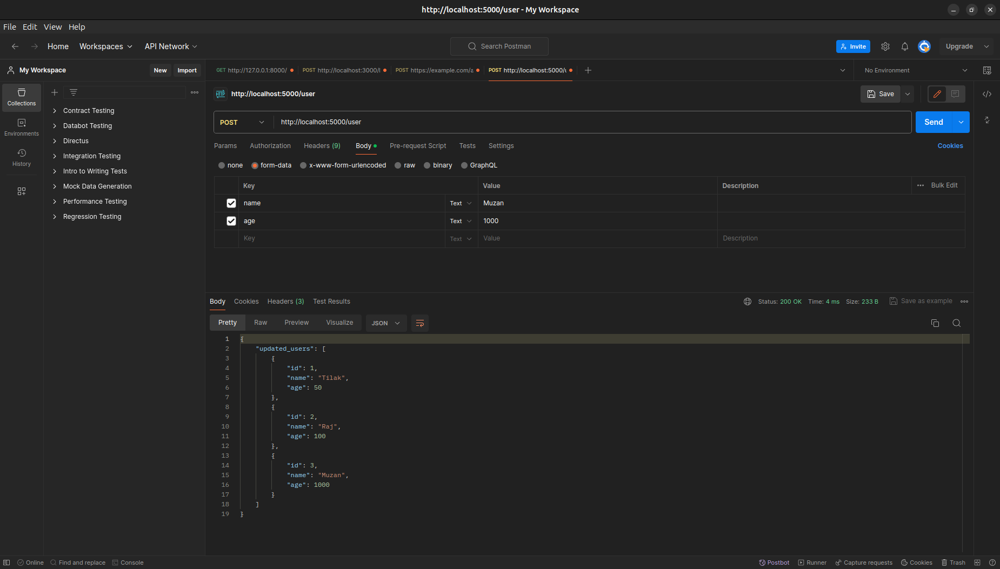
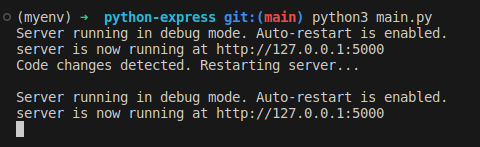
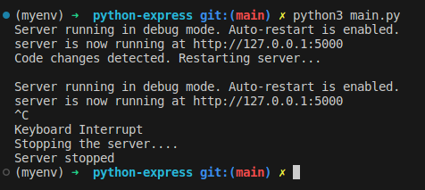

<h1 align="center">pythonExpress</h1>


An express like syntax to create http server using python.
Made for fun and to explore the workings of HTTP.


### Installation

```bash
# To install and use it in your project
pip install pythonExpress
```
### Features: 
* Express like syntax to create server in python
* Request and Response objects available
* Supports body(except binary and GraphQL) and header in request
* Supports render(), status(), send(), json() functions in response
* Supports HTML and RESTful APIs
* Debug mode for POSIX based operating systems

### Example usage:

#### HTML response:

Below is an example of a server created using pythonExpress to render html pages. The html files should be inside "templates" folder.

```python
from pythonExpress.http_server import HTTPServer

server = HTTPServer(port=5000)

@server.get('/')
def home(req, res):
    return res.render('home.html', {'name': 'Tilak', 'reason': 'fun'})

@server.get('/favicon.ico')
def far(req, res):
    return res.status(400).send('Favicon not found')
server.startServer()

```


#### RESTful APIs:

Below is an example of a server created using pythonExpress to handle basic RESTful APIs.

```python
from pythonExpress.http_server import HTTPServer

server = HTTPServer(port=5000)

users = [{'id': 1, 'name': 'Tilak', 'age': 50}, {'id': 2, 'name': 'Raj', 'age': 100}]
id = 3

@server.get('/users')
def get_users(req, res):
    return res.json({'users': users})

@server.post('/user')
def add_user(req, res):
    try:
        global id
        name = req.body.name
        age = req.body.age
        users.append({'id': id, 'name': name, 'age': int(age)})
        id = id +1
        return res.json({'updated_users': users})
    except:
        res.json(500).send('Something went wrong')

@server.put('/user')
def update_user(req, res):
    print(req)
    id = int(req.requestLine.query.id)
    for i, d in enumerate(users):
        if d['id'] == id:
            if req.body.name:
                users[i]['name'] = req.body.name
            if req.body.age:
                users[i]['age'] = req.body.age
            return res.json({'updated_users': users})
    return res.status(400).send(f'No user with id: {id} found')

@server.delete('/user')
def delete_user(req, res):
    id = int(req.requestLine.query.id)
    for i, d in enumerate(users):
        if d['id'] == id:
            del users[i]
            return res.json({'updated_users': users})
    return res.status(400).send(f'No user with id: {id} found')

server.startServer()

```


### Debug Mode: 

Also supports debug mode for POSIX based operating systems (not supported on windows)

```python
server.startServer(debug=True)
```



### License

MIT